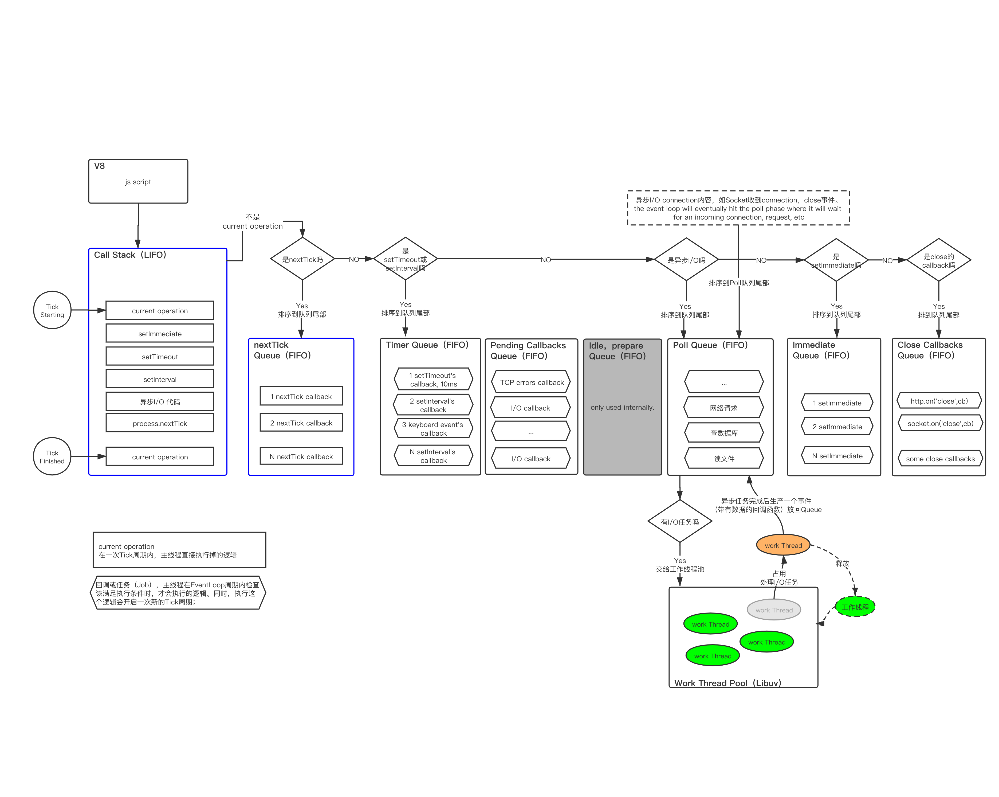

本文是在Demo和阅读官网和做多博客资料的基础上，对Node.js运行机制做出的学习整理，大致由以下内容组成：：
1. 遇到的问题
1. 方案和原理介绍
1. Demo执行过程分析
1. 对Node.js运行机制的总结

# 遇到的问题

在使用Node.js开发应用平台时，有个需求：先从数据库查询参数，将其转换为配置定义对象(Definition)，然后存放在内存中，通过一个定义管理器单例(Manager)供其他程序逻辑调用。如：并用于启动子进程。

实现如上需求的编码思路（仅仅给出伪代码做问题讨论）大致如下：

```js

function load(key) {
    // 1. 从数据库查询参数，并转换为定义对象
    let config = mysql.query(`select * from table where name = ${key}`)
    let defintion = new Definition(config)
    // 2. 返回加载到的定义
    return defintion
}

function doThing() {

    // 3. 在需要时触发定义加载，如：key='TEST'
    let def = load('TEST')

    // 4. 不符合预期：def为undefined，
    console.log(def)
}

```

以上代码逻辑看上去没问题，但为什么def是undefined？！

百度，看了很多网友博客，才明白这是因为Node.js是[非阻塞](./2020-03-13-nodejs-事件驱动和非阻塞I-O.md)的，通过load()方法触发了mysql.query()与数据库交互属于I/O事物，Node.js不会等待执行结束，而是继续执行后续代码，于是第2返回的defintion实际上是undefined。因此3步得到的是undefined。

改进，逻辑上应该等待load拿到定义对象后再save()，也就是需要进行同步处理，可以做如下2点改造：

```js

// 改造1: load方法返回Promise对象
function load(key) {
    return new Promise((resolve, reject) => {
        // 1. 从数据库查询参数，并转换为定义对象
        let config = mysql.query(`select * from table where name = ${key}`)
        let defintion = new Definition(config)
        // 2. 返回加载到的定义
        resolve(defintion)
    })
}


// 改造2: 在doThing()上使用async/await，以确保load方法能同步拿到加载结果（async/await代码可读性优于Promise/then）才执行后续代码
async function doThing(){
    // 3. 在需要时触发定义加载，如：key='TEST'
    let def = await load('TEST')

    // 4. 满足预期：def不再为undefined，
    console.log(def)
}

```

导致代码不同步的情况还有很多，如：setTimeout,setInterval,process.nextTick,setImmediate,http.on('connection',cb)...

为了弄清楚这些问题，过程中会涉及以下概念：

- [Node.js是单线程](./2020-03-15-nodejs-单线程.md)
- [Node.js的事件驱动和非阻塞I/O](./2020-03-13-nodejs-事件驱动和非阻塞I-O.md)
- [EventLoop](./2020-03-15-nodejs-EventLoop事件循环.md)
- [执行栈](https://nodejs.dev/the-nodejs-event-loop)

# 方案和原理介绍

看了网上找很多资料，摘抄内容见[《node-运行机制阅读摘抄》](./2020-03-31-nodejs-运行机制阅读摘抄.md)，似懂非懂，大体好像明白，但诸多细节不甚明了！

这些摘抄内容的解释大体是“打开冰箱门，大象放进去，关上冰箱门”，还是看看
[Node.js官网资料](https://nodejs.org/en/docs/guides/event-loop-timers-and-nexttick/#the-node-js-event-loop-timers-and-process-nexttick)。试着对Node.js的运行机制做细微一些的理解！

先借用[《Nodejs的运行原理-科普篇》](https://www.cnblogs.com/peiyu1988/p/8032982.html)一文对Node.js运行机制的比喻

>...NodeJS在寒风中面对着10万并发大军，OK，没问题，上来敌人一个扔到城里，上来一个又扔到城里。城里全民皆兵，可以很好地消化这些敌人...等民兵把敌人打个半死时，NodeJS再一刀斩于马下！

继续用：“敌人，扔进城里，打个半死，斩于马下”这过程比喻Node.js的运行机制！

### “敌人”，在Node.js里分两种：

- current operation，需要主线程立刻执行的代码；
- Blocking， 文件读取、数据库查询、Timer任务、网络请求等等。


### “扔到城里”是Node.js对异步任务的分类

Node.js主线程会直接处理current operation类型的代码，其他则分类到不同的队列，整个过程看起来如下图：



- 从执行node xx.js开始；
- V8负责解析xx.js代码并放入执行栈；
- 执行栈和nextTick Queue中的内容会在一次Tick周期内被执行——主线程清空执行栈后，立即处理nextTick Queue中的任务。
- 主线程处理Call Stack和nextTick Queue的过程构成一个Tick周期；
    >注意：Call Stack和nextTick Queue不属于EventLoop周期内的队列；
- 在EventLoop循环中，满足条件得到主线程处理的代码（current operation）都会开启一次新的Tick周期进行处理；
- Node.js在处理执行栈的任务时，用了很多FIFO队列来分类任务：
    - Timer Queue：通过setTimeout,setInterval设置的回调任务放在这个Queue。
    - Pending Callbacks Queue：executes I/O callbacks deferred to the next loop iteration.
    - Idle，prepare Queue：only used internally.
    - Poll Queue：retrieve new I/O events; execute I/O related callbacks (almost all with the exception of close callbacks, the ones scheduled by timers, and setImmediate()); node will block here when appropriate.
    - Immediate Queue：check: setImmediate() callbacks are invoked here.
    - Close Callbacks Queue：some close callbacks, e.g. socket.on('close', ...).
    >注意：上图队列只是用来做任务分类示意，不是EventLoop执行时检查队列的顺序，执行顺序见后文。

### “打个半死”表示异步任务已经满足执行条件

“打”这个动作由Libuv的Thread Pool在后台完成，流程如下图：


### “斩于马下”表示异步任务的callback得到Node.js的执行

当异步I/O完成，则对应的callback会被主线程开启一次Tick周期执行掉。

## 完整一些的EventLoop流程

除了异步I/O任务，还有Timer任务，实时收到的网络请求等待，接下来看下完整一些的EventLoop流程，如下图：


- 1、执行命令node xx.js开始，V8引擎会将js脚本代码解析并放入执行栈（call stack），Node.js主线程就开始处理代码了，EventLoop开始，同时也开始一个Tick；
- 2.0、主线程以后进先出的顺序处理执行栈中的代码，Current operation当场处理；
- 2.1、如果是process.nextTick() 放到nextTick queue，等到执行栈清空后，马上处理；
- 2.2、如果是I/O异步任务分放到Poll Queue，另外的按照任务分类规则放到对应的队列（线太多，不一一画了）；
- 2.3、如果执行栈为空则会处理nextTick Queue中的回调，这些代码是主线程同步处理的（所谓的nextTick就是指放在这个时机执行的代码）。当nextTick Queue也被清空，则表示完成一个Tick周期（图中 Tick Start - Tick End）。接着Node.js的EventLoop流程会进入Poll Queue的处理阶段（EventLoop entry poll phase）；
- 3.0、进入Poll Queue执行阶段，Node.js首先检查poll Queue是否为空；
- 3.1、不为空，继续检查是否超出最大运行poll循环限制（hard limit：根据操作系统不同的）；
- 3.2、没超出，则立刻同步方式处理这个回调逻辑（executing callbacks synchronously），注意：执行poll中的回调时，Node.js会将回调函数放到执行栈中，进行一轮新的Tick处理，每个回调一轮Tick；
- 3.3、结束一轮Tick，解决掉一个poll queue中的回调，回到3.0；
- 3.4、如果poll queue中的回调次数超过了硬件运行的数量限制，则报错，终止Node.js的Event Loop；
    >报错信息：RangeError: Maximum call stack size exceeded from v8
- 3.5、如果poll queue中的回调被处理完，也就是Poll Queue为空，这时Node.js会先判断immediate queue是否有内容，有，则进入Check phase。immediate queue中的内容是在此前处理poll queue中任务的各轮Tick中放进来的。
- 3.6、Node.js进入Check phase，按照先进先出的顺序处理immediate queue中的回调，注意：同样每个回调开一轮新的Tick处理，不过Node.js会连续处理完这个阶段的所有回调函数（待分析清楚）。
- 3.7、另外一种情况是不存在immediate，Node.js会跳过Check pahase，进而判断当前是否有已经完成的I/O异步任务
- 3.8、有I/O任务，则等待其执行完成；
- 3.9、Libuv会将处理完成的I/O任务事件（（回调函数和I/O异步任务获得的数据一起））放回poll queue，这是poll queue不为空，Node.js又按照3.0 - 3.3处理；
- 3.10、如果没有I/O任务，Node.js会检查是否有已经满足时点的Timer回调任务——指：setInterval、setTimeout。
- 3.11、没有，则回到poll phase继续等待新I/O任务 —— Libuv线程池处理好的事件，来自网络的I/O事件等等，都会加入到poll queue中。
- 4.0、如果有到点的Timer回调，Node.js的EventLoop将进入Timer phase，处理Timer Queue中满足执行条件的所有回调函数，同样每个回调一轮新的Tick；


至此，脑袋里出现了一个相对清晰的执行流程模型：Event Loop大圈，内套多次Tick小圈，满足执行条件的任务会开启一次Tick，否则Node.js将继续EventLoop等待下一个满足执行条件的任务！


# 写代码感受一下EventLoop和Tick

```js

// 阅读Node官网时做的Demo 
// 资料： https://nodejs.dev/understanding-setimmediate

// s1.js 中主要是说明了 nextTick 的执行时机， 那么 setImmediate的执行时机呢！？
// 为了验证，在s1.js的基础上，增加了 firstImmediate 函数，并且在最开始就调用！

const Promise = require('bluebird')
const fs = require('fs')

// Node 开始，把本Demo中的所有代码进行解析（V8），并绑定到Nodejs

var text = '因为不同步，读不到文件';

function firstTimeout(){
    console.log(">>>>> 3: first setTimeout")
}

function secondTimeout(){
    text = fs.readFileSync('./some.text',{ encoding: 'utf8' })
    console.log(">>>>> 3: second setTimeout , 现在才读到文件内容: ", text)
}

function thirdTimeout(){
    console.log(">>>>> 3: first setTimeout")
}

function p(){
    setTimeout(secondTimeout,0)
    return text ; 
}

function firstNextTick(arg){
    console.log(">>>>> 2: nextTick 111: ",arg)
}

function secondNextTick(arg){
    console.log(">>>>> 2: nextTick 222: ",arg)
}

function firstImmediate(){
    console.log(">>>>> 4: first setImmediate: ")
}

function secondImmediate(){
    console.log(">>>>> 4: second setImmediate: ")
}

// tick -1 : 上一次 Event Loop 结束，重新开始一次新的Tick

// tick 0 : start， 按照代码执行栈（The call stack），后进先出执行

// tick 1 : 执行setImmediate，把对应的callback行数firstImmediate排在下一次Event Loop开始时
setImmediate(firstImmediate) 

// tick 1 : 执行console.log，无阻塞，直接输出
console.log(">>>>> Demo start ")

// tick 2: 执行nextTick并把 callback函数firstNextTick 放到next tick start 之前 排序第1
process.nextTick(firstNextTick,['First operation when start a new tick!'])

// tick 2: 执行nextTick并把 callback函数secondNextTick 放到next tick start 之前 排序第2
process.nextTick(secondNextTick,['Second operation when start a new tick!'])

// tick 3 ：执行setTimeout，并把callback函数firstTimeout放到 Message Queue 排序第1
setTimeout(firstTimeout,0)

// tick 4 ：执行setTimeout，并把callback函数thirdTimeout放到 Message Queue 排序第2
setTimeout(thirdTimeout,10) // 10毫秒的等待会导致在fs同步读取文件之后

setImmediate( secondImmediate )

// tick 5 : 执行console.log()，无阻塞，直接完成输出
console.log('>>>>> 1: current operation')

// tick 6 : 执行console.log()，无阻塞，直接完成输出
console.log(">>>>> 1: current operation")

// tick 7 : 调用p(),执行p里面的setTimeout，将对应的callback行数secondTimeout放到 Message Queue 排序第3
console.log(">>>>> 1: ", p())

// tick 8 : Finish a tick trip. Ready to start a new tick

// tick 9 : 在开始一次新的tick之前，还得依加入顺序执行 nextTick的callback函数
//          先执行 firstNextTick，无阻塞，直接输出
//          再执行 secondNextTick，无阻塞，直接输出

// tick 10 : 执行完nextTick，才开始检查 Message Queue中的事件是否满足执行条件
//          Message Queue 为先进先出，因此会按进入MessageQueue的先后顺序检查是否满足执行条件
//          本Demo中：
//          先检查： firstTimeout 延迟为0毫秒，满足执行条件，直接执行，并输出
//          在检查： thirdTimeout 延迟5毫秒，这个延迟事件够短了，但是Nodejs执行到这个步骤时，都没有花掉5毫秒，因此未满足执行条件，保持在MessqgeQueu中
//          最后检查：secondTimeout 延迟为0毫秒，满足执行条件，直接执行，并且同步读取文件，并输出

// tick 11 : 准备开始一次新的Event Loop，但是之前，先处理setImmediate内容
//          执行firstImmediate，无阻塞，直接输出
//          执行secondImmediate，无阻塞，直接输出
//          已无setImmediate，可以开始一次新的Event Loop

// tick 12 : start new Event Loop ==> 相当于从 tick 0 又开始执行
//          检查执行栈是否有内容，无
//          检查nextTick是否有内容要处理 无
//          检查Message Queue是否有内容要处理，还有tick10时留下的thridTimeout，此刻已经满足执行条件（有可能Node走了好几次Event Loop才满足了这5毫秒），执行输出
//          检查是否存在setImmediate，无

// tick 13 : start a new Event Loop
//          检查执行栈是否有内容，无
//          检查nextTick是否有内容要处理，无
//          检查Message Queue，无
//          Node发现再无需要执行的operation，了无牵挂，结束了进程，退出Node


// 因此输出为：
// $ node s2.js
// >>>>> Demo start 
// >>>>> 1: current operation
// >>>>> 1: current operation
// >>>>> 1:  因为不同步，读不到文件
// >>>>> 2: nextTick 111:  [ 'First operation when start a new tick!' ]
// >>>>> 2: nextTick 222:  [ 'Second operation when start a new tick!' ]
// >>>>> 3: first setTimeout
// >>>>> 3: second setTimeout , 现在才读到文件内容:  进行文件I/O操作
// >>>>> 4: first setImmediate: 
// >>>>> 4: second setImmediate: 
// >>>>> 3: first setTimeout

// 看输出结果， “>>>>> 4” 这个阶段插在了3阶段中输出，这就是tick11，tick12 两个tick的效果。

// 此刻的体会：
// 在有道中查“tick”的含义，可理解为：发出滴答声，滴答的走时，用滴答声记录。 这个很形象的可以用来比喻Node.js执行js代码的步骤，就像Demo中的每个 "tick xx:"。 
// 而Node.js中还有另外一个重要概念是"Event Loop"，则可以理解为由一组规律循环的tick构建成处理过程。
// 换个说法，tick可看成时间走过1秒——Node.js执行了某个处理，
//         Event Loop则是由60次1秒组成的“1分钟”
//         无聊何时，拿出1分钟来讨论，其中组成都是60秒，这就是规律循环！
//         Node.js把Event Loop作为一次完整的JS处理过程，整个Node.js执行js代码时，就是通过无数的Event Loop完成的。
// 从扩展的角度来说，1分钟=60秒是人类约定的，如果有需要也可以改为 1分钟=100秒，有何不可！？
// 因此nextTick，setImmediate这些能力就按照需要加入到Event Loop周期中！

```


# 适合Node.js的场景( //TODO doing here ... )


# 方案优点

Node 公开宣称的目标是 “旨在提供一种简单的构建可伸缩网络程序的方法”。我们来看一个简单的例子，在 Java和 PHP 这类语言中，每个连接都会生成一个新线程，每个新线程可能需要 2 MB 的配套内存。在一个拥有 8 GB RAM 的系统上，理论上最大的并发连接数量是 4,000 个用户。随着您的客户群的增长，如果希望您的 Web 应用程序支持更多用户，那么，您必须添加更多服务器。所以在传统的后台开发中，整个 Web 应用程序架构（包括流量、处理器速度和内存速度）中的瓶颈是：服务器能够处理的并发连接的最大数量。这个不同的架构承载的并发数量是不一致的。
而Node的出现就是为了解决这个问题：更改连接到服务器的方式。在Node 声称它不允许使用锁，它不会直接阻塞 I/O 调用。Node在每个连接发射一个在 Node 引擎的进程中运行的事件，而不是为每个连接生成一个新的 OS 线程（并为其分配一些配套内存）。

# 方案缺点

如上所述，nodejs的机制是单线程，这个线程里面，有一个事件循环机制，处理所有的请求。在事件处理过程中，它会智能地将一些涉及到IO、网络通信等耗时比较长的操作，交由worker threads去执行，执行完了再回调，这就是所谓的异步IO非阻塞吧。但是，那些非IO操作，只用CPU计算的操作，它就自己扛了，比如算什么斐波那契数列之类。它是单线程，这些自己扛的任务要一个接着一个地完成，前面那个没完成，后面的只能干等。因此，对CPU要求比较高的CPU密集型任务多的话，就有可能会造成号称高性能，适合高并发的node.js服务器反应缓慢。

# 适用场景

既然NodeJS处理并发的能力强，但处理计算和逻辑的能力反而很弱，因此，如果我们把复杂的逻辑运算都搬到前端（客户端）完成，而NodeJS只需要提供异步I/O，这样就可以实现对高并发的高性能处理。情况就很多啦，比如：RESTFUL API、实时聊天、客户端逻辑强大的单页APP，具体的例子比如说：本地化的在线音乐应用，本地化的在线搜索应用，本地化的在线APP等。
顺便提一下Apache，打压了这么多，给颗甜枣。Apache由于其多线程高并发共享内存地址空间的特性，那就意味着如果服务器足够强大，处理器足够高核，Apache的运作将会非常良好，所以适用于（并发）异步处理相对较少，后台计算量大，后台业务逻辑复杂的应用程序。


1、RESTful API

这是适合 Node 的理想情况，因为您可以构建它来处理数万条连接。它仍然不需要大量逻辑；它本质上只是从某个数据库中查找一些值并将它们组成一个响应。由于响应是少量文本，入站请求也是少量的文本，因此流量不高，一台机器甚至也可以处理最繁忙的公司的 API 需求。完成数据型应用中对数据的获取功能。

2、实时程序

比如聊天服务

聊天应用程序是最能体现 Node.js 优点的例子：轻量级、高流量并且能良好的应对跨平台设备上运行密集型数据（虽然计算能力低）。同时，聊天也是一个非常值得学习的用例，因为它很简单，并且涵盖了目前为止一个典型的 Node.js 会用到的大部分解决方案。

3、单页APP

ajax很多。现在单页的机制似乎很流行，比如phonegap做出来的APP，一个页面包打天下的例子比比皆是。

总而言之，NodeJS适合运用在高并发、I/O密集、少量业务逻辑的场景；

适合当转手掌柜！


# 总结

- 主进程非阻塞执行
- 主进程从任务队列中获取并触发执行
- 具体的执行交给工作线程处理
- 工作线程执行完成返回一个事件到任务队列


# 参考

>A Node.js app is run in a single process, without creating a new thread for every request. Node.js provides a set of asynchronous I/O primitives in its standard library that prevent JavaScript code from blocking and generally, libraries in Node.js are written using non-blocking paradigms, making blocking behavior the exception rather than the norm.
>When Node.js needs to perform an I/O operation, like reading from the network, accessing a database or the filesystem, instead of blocking the thread and wasting CPU cycles waiting, Node.js will resume the operations when the response comes back.
>This allows Node.js to handle thousands of concurrent connections with a single server without introducing the burden of managing thread concurrency, which could be a significant source of bugs.

>When setTimeout() is called, the Browser or Node.js start the timer. Once the timer expires, in this case immediately as we put 0 as the timeout, the callback function is put in the Message Queue.

The Message Queue is also where user-initiated events like click or keyboard events, or fetch responses are queued before your code has the opportunity to react to them. Or also DOM events like onLoad.

The loop gives priority to the call stack, and it first processes everything it finds in the call stack, and once there's nothing in there, it goes to pick up things in the message queue.

- [Introduction to Node.js（官网）](https://nodejs.dev/introduction-to-nodejs  )


>Node是一个服务器端JavaScript解释器，用于方便地搭建响应速度快、易于扩展的网络应用。Node使用事件驱动，非阻塞I/O 模型而得以轻量和高效，非常适合在分布式设备上运行数据密集型的实时应用。
Node是一个可以让JavaScript运行在浏览器之外的平台。它实现了诸如文件系统、模块、包、操作系统 API、网络通信等Core JavaScript没有或者不完善的功能。历史上将JavaScript移植到浏览器外的计划不止一个，但Node.js 是最出色的一个。
> - [Nodejs的运行原理-科普篇](https://www.cnblogs.com/peiyu1988/p/8032982.html)

