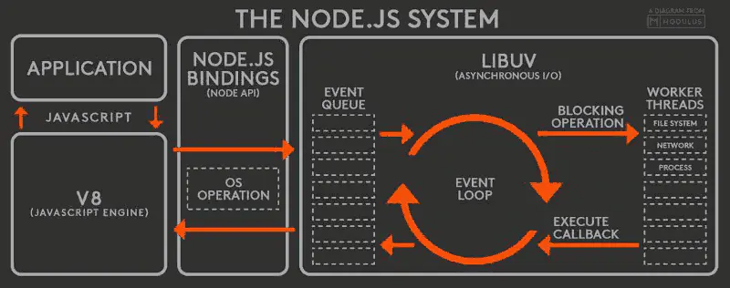

本文内容组成：
1. 遇到的问题
1. 方案和原理分析
1. Demo代码分析
1. 对Node.js优缺点、适用场景分析

分析过程中会涉及以下概念：

- [Node.js是单线程](./2020-03-15-nodejs-单线程.md)
- [执行栈](https://nodejs.dev/the-nodejs-event-loop)
- [Node.js的事件驱动和非阻塞I/O](./2020-03-13-nodejs-事件驱动和非阻塞I-O.md)
- [EventLoop](./2020-03-15-nodejs-EventLoop事件循环.md)


# 遇到的问题

在使用Node.js开发应用平台时，有个需求：先从数据库查询参数，将其转换为配置定义对象(Definition)，然后存放在内存中，通过一个定义管理器单例(Manager)供其他程序逻辑调用。如：并用于启动子进程。

实现如上需求的编码思路（仅仅给出伪代码做问题讨论）大致如下：

```js

function load(key) {
    // 1. 从数据库查询参数，并转换为定义对象
    let config = mysql.query(`select * from table where name = ${key}`)
    let defintion = new Definition(config)
    // 2. 返回加载到的定义
    return defintion
}

function doThing() {

    // 3. 在需要时触发定义加载，如：key='TEST'
    let def = load('TEST')

    // 4. 不符合预期：def为undefined，
    console.log(def)
}

```

以上代码逻辑看上去没问题，但为什么def是undefined？！

百度，看了很多网友博客，才明白这是因为Node.js是[非阻塞](./2020-03-13-nodejs-事件驱动和非阻塞I-O.md)的，通过load()方法触发了mysql.query()与数据库交互属于I/O事物，Node.js不会等待执行结束，而是继续执行后续代码，于是第2返回的defintion实际上是undefined。因此3步得到的是undefined。

改进 —— 逻辑上应该等待load拿到定义对象后再save()，也就是需要进行同步处理，可以做如下两点改造：

```js

// 改造1: load方法返回Promise对象
function load(key) {
    return new Promise((resolve, reject) => {
        // 1. 从数据库查询参数，并转换为定义对象
        let config = mysql.query(`select * from table where name = ${key}`)
        let defintion = new Definition(config)
        // 2. 返回加载到的定义
        resolve(defintion)
    })
}


// 改造2: 在doThing()上使用async/await，以确保load方法能同步拿到加载结果（async/await代码可读性优于Promise/then）才执行后续代码
async function doThing(){
    // 3. 在需要时触发定义加载，如：key='TEST'
    let def = await load('TEST')

    // 4. 满足预期：def不再为undefined，
    console.log(def)
}

```

在Node.js的世界里，不同步的情况还有很多，如：setTimeout、setInterval、文件读写、数据库查询、网络请求http.on('connection',cb)等等

# 方案和原理介绍

针对问题以及Node.js的运行原理，看了网上找很多资料，摘抄内容见[《node-运行机制阅读摘抄》](./2020-03-31-nodejs-运行机制阅读摘抄.md)，似懂非懂，大体好像明白，但诸多细节不甚明了！

目前脑袋里对Node.js的认知限于——“打开冰箱门，大象放进去，关上冰箱门”！于是看
[Node.js官网资料](https://nodejs.org/en/docs/guides/event-loop-timers-and-nexttick/#the-node-js-event-loop-timers-and-process-nexttick)。试着对Node.js的运行机制做更细微一些的理解！

先借用[《Nodejs的运行原理-科普篇》](https://www.cnblogs.com/peiyu1988/p/8032982.html)一文对Node.js运行机制的比喻

>...NodeJS在寒风中面对着10万并发大军，OK，没问题，上来敌人一个扔到城里，上来一个又扔到城里。城里全民皆兵，可以很好地消化这些敌人...等民兵把敌人打个半死时，NodeJS再一刀斩于马下！

作者很好的用“敌人来了，扔进城里，打个半死，斩于马下”这个过程比喻Node.js的运行机制！

### “敌人”，在Node.js里分两种：

- current operation，也就是非异步操作，由主线程立刻执行的代码；
- Blocking， 异步操作，如：文件读取、数据库查询、Timer任务、网络请求等等。

### “扔到城里”是Node.js对异步任务的分类

Node.js主线程不会直接处理Blocking类型的代码，而是将其分类到不同的队列，等后台线程处理好了，再执行对应的回调，整个分类过程看起来如下图：


- 执行node xx.js时，V8解析xx.js代码并放入执行栈；
- 执行栈和nextTick Queue中的内容会在一次Tick周期内被主线执行 —— 主线程清空执行栈后，立即处理nextTick Queue中的任务。
- 主线程处理Call Stack和nextTick Queue的过程构成一个完整的Tick周期；
    >注意：Call Stack和nextTick Queue不属于EventLoop周期内的队列；
- EventLoop循环中，满足执行条件的回调会被Node.js放回调用栈（变为了current operation），执行栈有内容，则主线程开始一轮新的Tick周期将之处理
    > “放回执行栈”这么说并不严谨，但是有助于对下文Node.js运行机制的理解。
- 对于Blocing任务Node.js用用了下面几种FIFO的队列来分类：
    - Timer Queue
    
        this phase executes callbacks scheduled by setTimeout() and setInterval().
    
    - Pending Callbacks Queue
        
        executes I/O callbacks deferred to the next loop iteration.

    - Idle，prepare Queue
        
        only used internally.
    - Poll Queue
        
        retrieve new I/O events; execute I/O related callbacks (almost all with the exception of close callbacks, the ones scheduled by timers, and setImmediate()); node will block here when appropriate.
    - Immediate Queue
        
        setImmediate() callbacks are invoked here.
    - Close Callbacks Queue
        
        some close callbacks, e.g. socket.on('close', ...).

    >注意：上图示意不意味着EventLoop执行时检查队列的顺序，只是用来做任务分类示意。

### “打个半死”表示异步任务已经满足执行条件

“打”这个动作由Libuv的Thread Pool在后台完成，流程如下图：


工作线程（Work Thread）处理完某个异步任务，会将数据绑定在callback函数上并放回事件队列（Poll Queue）。

### “斩于马下”表示Node.js处理了绑定了数据的callback回调函数

在EventLoop过程中，已完成的异步任务，主线程将开启一次新的Tick周期处理绑定了数据的回调函数。

# EventLoop流程

除了异步I/O任务，还有Timer任务，实时收到的网络请求等待，接下来看下完整一些的EventLoop流程，如下图：


- 1、执行命令node xx.js开始，V8引擎会将js脚本代码解析并放入执行栈（call stack），Node.js主线程就开始处理代码了，EventLoop开始，同时也开始一个Tick；
- 2.0、主线程以后进先出的顺序处理执行栈中的代码，Current operation当场处理；
- 2.1、如果是process.nextTick() 放到nextTick queue，等到执行栈清空后，马上处理；
- 2.2、如果是I/O异步任务分放到Poll Queue，另外的按照任务分类规则放到对应的队列（线太多，不一一画了）；
- 2.3、如果执行栈为空则会处理nextTick Queue中的回调，这些代码是主线程同步处理的（所谓的nextTick就是指放在这个时机执行的代码）。当nextTick Queue也被清空，则表示完成一个Tick周期（图中 Tick Start - Tick End）。接着Node.js的EventLoop流程会进入Poll Queue的处理阶段（EventLoop entry poll phase）；
- 3.0、进入Poll Queue执行阶段，Node.js首先检查poll Queue是否为空；
- 3.1、不为空，继续检查是否超出最大运行poll循环限制（hard limit：根据操作系统不同的）；
- 3.2、没超出，则立刻同步方式处理这个回调逻辑（executing callbacks synchronously），注意：执行poll中的回调时，Node.js会将回调函数放到执行栈中，进行一轮新的Tick处理，每个回调一轮Tick；
- 3.3、结束一轮Tick，解决掉一个poll queue中的回调，回到3.0；
- 3.4、如果poll queue中的回调次数超过了硬件运行的数量限制，则报错，终止Node.js的Event Loop；
    >报错信息：RangeError: Maximum call stack size exceeded from v8
- 3.5、如果poll queue中的回调被处理完，也就是Poll Queue为空，这时Node.js会先判断immediate queue是否有内容，有，则进入Check phase。immediate queue中的内容是在此前处理poll queue中任务的各轮Tick中放进来的。
- 3.6、Node.js进入Check phase，按照先进先出的顺序处理immediate queue中的回调，注意：同样每个回调开一轮新的Tick处理，不过Node.js会连续处理完这个阶段的所有回调函数（待分析清楚）。
- 3.7、另外一种情况是不存在immediate，Node.js会跳过Check pahase，进而判断当前是否有已经完成的I/O异步任务
- 3.8、有I/O任务，则等待其执行完成；
- 3.9、Libuv会将处理完成的I/O任务事件（（回调函数和I/O异步任务获得的数据一起））放回poll queue，这是poll queue不为空，Node.js又按照3.0 - 3.3处理；
- 3.10、如果没有I/O任务，Node.js会检查是否有已经满足时点的Timer回调任务——指：setInterval、setTimeout。
- 3.11、没有，则回到poll phase继续等待新I/O任务 —— Libuv线程池处理好的事件，来自网络的I/O事件等等，都会加入到poll queue中。
- 4.0、如果有到点的Timer回调，Node.js的EventLoop将进入Timer phase，处理Timer Queue中满足执行条件的所有回调函数，同样每个回调一轮新的Tick；


至此，脑袋有一个相对清晰的Node.js运行流程模型：Event Loop大圈内套了很多次Tick小圈，这些Tick小圈是Blocking任务满足执行条件时开启的，如果没有满足执行条件的Blocking任务，Node.js将停等待下一个满足执行条件的任务（3.8）！


# 写代码感受一下EventLoop和Tick

新建 s3.js，内容如下：

```js 

console.log('0: 启动Node.js，开始了第一轮EventLoop，开始了第一轮Tick')
console.log('1: 第一轮Tick时，第一个非阻塞函数（current function）')
console.log('2: 第一轮Tick时，第二个非阻塞函数（current function）')
process.nextTick(()=>{ console.log('3: 第一轮Tick时，第一个放到nextTick阶段的回调函数。执行栈已空时执行，在nextTick中排序第一')})

setTimeout(()=>{console.log('13: 第一轮Tick时，第一个放入MessageQueue的setTimeout回调函数 延时10毫秒。终于到10毫秒了，Node.js新开一轮Tick执行我')},10)
setTimeout(()=>{console.log('14: 第一轮Tick时，第二个放入MessageQueue的setTimeout回调函数 延时10毫秒。终于到10毫秒了，但是在MessageQueue中我排在13后。')},10)
setTimeout(()=>{
    console.log('15: 第一轮Tick时，第三个放入MessageQueue的setTimeout回调函数 延时10毫秒。终于到10毫秒了，但是在MessageQueue中我排在14后');
    process.nextTick(()=>{
        console.log('16: 输出15步的Tick轮次时加入nextTick，该轮次结束时，输出了我。')
        console.log('17: 没有任何Blocking任务，Node.js结束EventLoop，退出Node.js')
    })
},10)
setTimeout(()=>{
    console.log('5: 第一轮Tick时，第四个放入MessageQueue的setTimeout回调函数 虽然是第四个放入MessageQueue的setTimeout，但延时0毫秒，第一轮Tick结束时Node.js检查已满足触发条件，将对应的回调函数放回执行栈，因调用栈非空，Node.js开始了新一轮Tick（第二轮），本输出发生在在第二轮Tick时');
    process.nextTick(()=>{console.log('6: 第二轮Tick时，加入nextTick阶段的回调函数。因为Node.js逐个检查和执行MessageQueue中的Job（处理过程见5），因此第二轮Tick结束时立即执行输出')})},0) 
setTimeout(()=>{
    console.log('7: 第一轮Tick时，第五个放入MessageQueue的setTimeout回调函数，虽然也是延时0毫秒，但是按MessageQueu的先进先出原则，Node.js在处理完5后，才检查这个Job，处理过程同5，Node.js又开始轮新一轮Tick（第三轮），本输出发生在第三轮Tick时');
    process.nextTick(()=>{console.log('8: 第三轮Tick时，加入nextTick阶段的回调函数，因此第三轮Tick结束时立即执行输出')})},0) //FIXME nextTic再加入nextTick呢？本轮，还是下一轮Tick执行

setImmediate(()=>{
    setTimeout(()=>{console.log('xx: 我在可能在13前或16后输出，根据Node.js的处理速度，在10毫秒以内则输出在13前，大于10毫秒则输出在16后，因为这个setTimeout排在MessageQueue最后！')},0)
    console.log('9: 第一轮Tick时，第一个放在Next new EventLoop start之前的setImmediate回调函数。Node.js经过以上三轮次Tick处理后，发现执行栈为空，且MessageQueue没有满足条件的Job需要处理，准备开始下一轮EventLoop处理。setImmediate的执行时机就在下一轮EventLoop开始前，我又是第一个，Node.js会把回调函数放回执行栈，执行栈非空，Node.js开始新一轮Tick（第四轮），本输出发生在第四轮Tick时');
    process.nextTick(()=>{console.log('10: 第四轮Tick时，加入nextTick阶段的回调函数，因此第四轮Tick结束时立即执行输出')}) 
})

setImmediate(()=>{
    console.log('11: 第一轮Tick时，第二个放在Next new EventLoop start之前的setImmediate回调函数。执行完9，Node.js又开启一轮Tick（第五轮）处理这个setImmediate。本输出发生在第五轮Tick时')
    process.nextTick(()=>{console.log('12: 第五轮Tick时，加入nextTick阶段的回调函数，因此第五轮Tick结束时立即执行输出')}) 
})

setTimeout(()=>{console.log('xx: 第一轮Tick时，第六个放入MessageQueue的setTimeout回调函数，输出顺序飘忽，但肯定都在nextTick之后。飘忽位置，取决于Node.js执行到第XX轮Tick的耗时是否达到了2毫秒，如果达到，将在当前轮Tick结束时得到执行。例如：第三轮Tick结束时，Node.js的处理耗时已经2毫秒，则我会输出在8后（Node.js开始新一个Tick执行我）')},2) 

process.nextTick(()=>{ console.log('4: 第一轮Tick时，第二个放到nextTick阶段的回调函数。执行栈已空时执行，在nextTick中排序第二。第一轮Tick正式结束！')})

```

执行命令 node s3.js 看具体结果（根据机器性能会稍有不同）
```shell
$ node s3.js 
0: 启动Node.js，开始了第一轮EventLoop，开始了第一轮Tick
1: 第一轮Tick时，第一个非阻塞函数（current function）
2: 第一轮Tick时，第二个非阻塞函数（current function）
3: 第一轮Tick时，第一个放到nextTick阶段的回调函数。执行栈已空时执行，在nextTick中排序第一
4: 第一轮Tick时，第二个放到nextTick阶段的回调函数。执行栈已空时执行，在nextTick中排序第二。第一轮Tick正式结束！
5: 第一轮Tick时，第四个放入MessageQueue的setTimeout回调函数 虽然是第四个放入MessageQueue的setTimeout，但延时0毫秒，第一轮Tick结束时Node.js检查已满足触发条件，将对应的回调函数放回执行栈，因调用栈非空，Node.js开始了新一轮Tick（第二轮），本输出发生在在第二轮Tick时
6: 第二轮Tick时，加入nextTick阶段的回调函数。因为Node.js逐个检查和执行MessageQueue中的Job（处理过程见5），因此第二轮Tick结束时立即执行输出
7: 第一轮Tick时，第五个放入MessageQueue的setTimeout回调函数，虽然也是延时0毫秒，但是按MessageQueu的先进先出原则，Node.js在处理完5后，才检查这个Job，处理过程同5，Node.js又开始轮新一轮Tick（第三轮），本输出发生在第三轮Tick时
8: 第三轮Tick时，加入nextTick阶段的回调函数，因此第三轮Tick结束时立即执行输出
9: 第一轮Tick时，第一个放在Next new EventLoop start之前的setImmediate回调函数。Node.js经过以上三轮次Tick处理后，发现执行栈为空，且MessageQueue没有满足条件的Job需要处理，准备开始下一轮EventLoop处理。setImmediate的执行时机就在下一轮EventLoop开始前，我又是第一个，Node.js会把回调函数放回执行栈，执行栈非空，Node.js开始新一轮Tick（第四轮），本输出发生在第四轮Tick时
10: 第四轮Tick时，加入nextTick阶段的回调函数，因此第四轮Tick结束时立即执行输出
11: 第一轮Tick时，第二个放在Next new EventLoop start之前的setImmediate回调函数。执行完9，Node.js又开启一轮Tick（第五轮）处理这个setImmediate。本输出发生在第五轮Tick时
12: 第五轮Tick时，加入nextTick阶段的回调函数，因此第五轮Tick结束时立即执行输出
xx: 第一轮Tick时，第六个放入MessageQueue的setTimeout回调函数，输出顺序飘忽，但肯定都在nextTick之后。飘忽位置，取决于Node.js执行到第XX轮Tick的耗时是否达到了2毫秒，如果达到，将在当前轮Tick结束时得到执行。例如：第三轮Tick结束时，Node.js的处理耗时已经2毫秒，则我会输出在8后（Node.js开始新一个Tick执行我）
xx: 我在可能在13前或16后输出，根据Node.js的处理速度，在10毫秒以内则输出在13前，大于10毫秒则输出在16后，因为这个setTimeout排在MessageQueue最后！
13: 第一轮Tick时，第一个放入MessageQueue的setTimeout回调函数 延时10毫秒。终于到10毫秒了，Node.js新开一轮Tick执行我
14: 第一轮Tick时，第二个放入MessageQueue的setTimeout回调函数 延时10毫秒。终于到10毫秒了，但是在MessageQueue中我排在13后。
15: 第一轮Tick时，第三个放入MessageQueue的setTimeout回调函数 延时10毫秒。终于到10毫秒了，但是在MessageQueue中我排在14后
16: 输出15步的Tick轮次时加入nextTick，该轮次结束时，输出了我。
17: 没有任何Blocking任务，Node.js结束EventLoop，退出Node.js

```

看完代码运行结果，集中精力看下图中的「Event Loop」，体会一下EventLoop，一轮完整的EventLoop周期是怎么样的！




# Node.js方案的优点

适合高并发场景！

Node 公开宣称的目标是 “旨在提供一种简单的构建可伸缩网络程序的方法”。我们来看一个简单的例子，在 Java和 PHP 这类语言中，每个连接都会生成一个新线程，每个新线程可能需要 2 MB 的配套内存。在一个拥有 8 GB RAM 的系统上，理论上最大的并发连接数量是 4,000 个用户。随着您的客户群的增长，如果希望您的 Web 应用程序支持更多用户，那么，您必须添加更多服务器。所以在传统的后台开发中，整个 Web 应用程序架构（包括流量、处理器速度和内存速度）中的瓶颈是：服务器能够处理的并发连接的最大数量。这个不同的架构承载的并发数量是不一致的。

而Node的出现就是为了解决这个问题：更改连接到服务器的方式。

在Node 声称它不允许使用锁，它不会直接阻塞 I/O 调用。Node在每个连接发射一个在 Node 引擎的进程中运行的事件，而不是为每个连接生成一个新的 OS 线程（并为其分配一些配套内存）。

# Node.js方案的缺点

不适合CPU密集型处理！

如上所述，nodejs的机制是单线程，这个线程里面，有一个事件循环机制，处理所有的请求。在事件处理过程中，它会智能地将一些涉及到IO、网络通信等耗时比较长的操作，交由worker threads去执行，执行完了再回调，这就是所谓的异步IO非阻塞。但是，那些非IO操作，只用CPU计算的操作，它就自己扛了，比如算什么斐波那契数列之类。它是单线程，这些自己扛的任务要一个接着一个地完成，前面那个没完成，后面的只能干等。

因此，对CPU要求比较高的CPU密集型任务多的话，就有可能会造成号称高性能，适合高并发的node.js服务器反应缓慢。

相对而已CPU密集型的场景可以选用Apache——Apache具有多线程高并发共享内存地址空间的特性，那就意味着如果服务器足够强大，处理器足够高核，Apache的运作将会非常良好，所以适用于（并发）异步处理相对较少，后台计算量大，后台业务逻辑复杂的应用程序。

>数据密集型：Data-Intensive applications，数据是其主要挑战（数据量，数据复杂度，数据变化速度），与之相对的是计算密集型，即处理器速度是其瓶颈。现今很多数据都是数据密集型的，而非计算密集型，CPU很少成为瓶颈。[数据密集型应用](https://www.jianshu.com/p/b83ac0c3032f)


# 适用场景举例

既然NodeJS处理并发的能力强，但处理计算和逻辑的能力反而很弱，因此，如果我们把复杂的逻辑运算都搬到前端（客户端）完成，而NodeJS只需要提供异步I/O，这样就可以实现对高并发的高性能处理。

这样的场景有很多，比如：

1、RESTful API

这是适合 Node 的理想情况，因为您可以构建它来处理数万条连接。它仍然不需要大量逻辑；它本质上只是从某个数据库中查找一些值并将它们组成一个响应。由于响应是少量文本，入站请求也是少量的文本，因此流量不高，一台机器甚至也可以处理最繁忙的公司的 API 需求。完成数据型应用中对数据的获取功能。

2、实时程序

比如聊天服务

聊天应用程序是最能体现 Node.js 优点的例子：轻量级、高流量并且能良好的应对跨平台设备上运行密集型数据（虽然计算能力低）。同时，聊天也是一个非常值得学习的用例，因为它很简单，并且涵盖了目前为止一个典型的 Node.js 会用到的大部分解决方案。

3、单页APP

客户端逻辑强大的单页APP，比如说：本地化的在线音乐应用，本地化的在线搜索应用，本地化的在线APP等。
ajax很多。现在单页的机制似乎很流行，比如phonegap做出来的APP，一个页面包打天下的例子比比皆是。

总而言之，NodeJS适合运用在高并发、I/O密集、少量业务逻辑（只有一个线程）的场景；


# 参考资料

- [Introduction to Node.js（官网）](https://nodejs.dev/introduction-to-nodejs  )
    >A Node.js app is run in a single process, without creating a new thread for every request. Node.js provides a set of asynchronous I/O primitives in its standard library that prevent JavaScript code from blocking and generally, libraries in Node.js are written using non-blocking paradigms, making blocking behavior the exception rather than the norm.

- [Nodejs的运行原理-科普篇](https://www.cnblogs.com/peiyu1988/p/8032982.html)
    >Node是一个服务器端JavaScript解释器，用于方便地搭建响应速度快、易于扩展的网络应用。Node使用事件驱动，非阻塞I/O 模型而得以轻量和高效，非常适合在分布式设备上运行数据密集型的实时应用。Node是一个可以让JavaScript运行在浏览器之外的平台。它实现了诸如文件系统、模块、包、操作系统 API、网络通信等Core JavaScript没有或者不完善的功能。历史上将JavaScript移植到浏览器外的计划不止一个，但Node.js 是最出色的一个。


