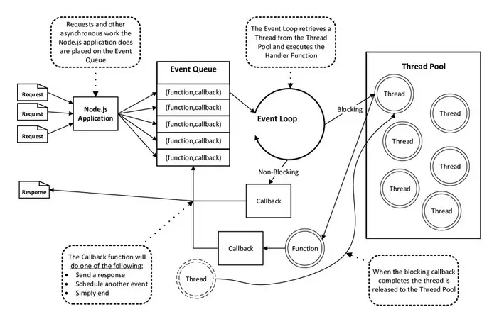

把单进程、事件驱动编程、非阻塞I/O模型等知识点结合起来认知理解，才是一个完整的Nodejs全景。

# 面对的问题

应用程序处理请求的过程中可以分为两个部分：CPU运算和I/O读写。通常CPU计算速度远高于I/O操作速度，这就导致CPU运算已经完成，但是不得不等待I/O任务完成之后再继续接下来处理。
所以I/O会成为某些应用程序的瓶颈所在，假设在I/O密集型应用场景中，一次请求/响应的耗时为100ms，其中90ms花在I/O上。

那么问题来了，以上场景如何优化，才能让系统能同时处理更多的请求？

一种方案是采用多线程，按照并发量开启同等数量的线程或建立可复用的线程池，来提升对请求吞吐量。但是，由于CPU在一个时刻只能做一件事情，操作系统只能通过将CPU切分为时间片的方法，让线程较为均匀的使用CPU资源，操作系统在内核切换线程的同时也要切换线程的上下文，当线程数量过多时，时间将会被消耗在上下文切换中。在大并发时，多线程结构还是无法做到强大的伸缩性。

# Node的方案

因此，Node采用了单线程的结构，避免上下文切换了浪费，让CPU专心致志干活！

> “单线程的最大好处，是不用像多线程编程那样处处在意状态的同步问题，这里没有死锁的存在，也没有线程上下文切换所带来的性能上的开销” —— 《深入浅出Node》

- 所有同步任务都在主线程上执行，形成一个执行栈
- 主线程发起异步请求,相应的工作线程就会去执行异步任务,
- 主线程可以继续执行后面的代码
- 主线程之外，还存在一个"任务队列"（task queue）。只要异步任务
- 有了运行结果，就在"任务队列"之中放置一个事件,也就是一个消息。
- 一旦"执行栈"中的所有同步任务执行完毕，系统就会读取"任务队列"，看看里面有哪些事件。那些对应的异步任务，于是结束等待状态，进入执行栈，开始执行。
- 主线程把当前的事件执行完成之后,再去读取任务队列,如此反复重复执行,这样就形成了事件循环（Event Loop）。
- 只要主线程空了，就会去读取"任务队列"，这就是JavaScript的运行机制。
- 这个过程会不断重复。

因此，Node.js的单线程并不是真正的单线程，只是开启了单个线程进行业务处理（cpu的运算），同时开启了其他线程专门处理I/O。当一个指令到达主线程，主线程发现有I/O之后，直接把这个事件传给I/O线程，不会等待I/O结束后，再去处理下面的业务，而是拿到一个状态后立即往下走，这就是“单线程”、“异步I/O”。

I/O处理完之后会有一个回调事件，这个事件会放在一个事件处理队列里头，在进程启动时node会创建一个类似于While(true)的循环，它的每一次轮询（tick）都会去查看是否有事件需要处理，是否有事件关联的回调函数需要处理，如果有就处理，然后加入下一个轮询，如果没有就退出进程，这就是所谓的“事件驱动”。这也从Node的角度解释了什么是”事件驱动”。

在node.js中，事件主要来源于网络请求，文件I/O等，根据事件的不同对观察者进行了分类，有文件I/O观察者，网络I/O观察者。事件驱动是一个典型的生产者/消费者模型，请求到达观察者那里，事件循环从观察者进行消费，主线程就可以马不停蹄的只关注业务不用再去进行I/O等待。

（1）V8 JavaScript引擎负责解析JavaScript脚本并执行代码。

（2）解析后的代码，调用Node API。

（3）libuv库负责NodeAPI的执行。它将不同的任务分配给不同的线程，形成一个Event Loop（事件循环），以异步的方式将任务的执行结果返回给V8引擎。

（4）V8引擎再将结果返回给用户。

# 方案优点

Node 公开宣称的目标是 “旨在提供一种简单的构建可伸缩网络程序的方法”。我们来看一个简单的例子，在 Java和 PHP 这类语言中，每个连接都会生成一个新线程，每个新线程可能需要 2 MB 的配套内存。在一个拥有 8 GB RAM 的系统上，理论上最大的并发连接数量是 4,000 个用户。随着您的客户群的增长，如果希望您的 Web 应用程序支持更多用户，那么，您必须添加更多服务器。所以在传统的后台开发中，整个 Web 应用程序架构（包括流量、处理器速度和内存速度）中的瓶颈是：服务器能够处理的并发连接的最大数量。这个不同的架构承载的并发数量是不一致的。
而Node的出现就是为了解决这个问题：更改连接到服务器的方式。在Node 声称它不允许使用锁，它不会直接阻塞 I/O 调用。Node在每个连接发射一个在 Node 引擎的进程中运行的事件，而不是为每个连接生成一个新的 OS 线程（并为其分配一些配套内存）。

# 方案缺点

如上所述，nodejs的机制是单线程，这个线程里面，有一个事件循环机制，处理所有的请求。在事件处理过程中，它会智能地将一些涉及到IO、网络通信等耗时比较长的操作，交由worker threads去执行，执行完了再回调，这就是所谓的异步IO非阻塞吧。但是，那些非IO操作，只用CPU计算的操作，它就自己扛了，比如算什么斐波那契数列之类。它是单线程，这些自己扛的任务要一个接着一个地完成，前面那个没完成，后面的只能干等。因此，对CPU要求比较高的CPU密集型任务多的话，就有可能会造成号称高性能，适合高并发的node.js服务器反应缓慢。

# 适用场景

1、RESTful API

这是适合 Node 的理想情况，因为您可以构建它来处理数万条连接。它仍然不需要大量逻辑；它本质上只是从某个数据库中查找一些值并将它们组成一个响应。由于响应是少量文本，入站请求也是少量的文本，因此流量不高，一台机器甚至也可以处理最繁忙的公司的 API 需求。完成数据型应用中对数据的获取功能。

2、实时程序

比如聊天服务

聊天应用程序是最能体现 Node.js 优点的例子：轻量级、高流量并且能良好的应对跨平台设备上运行密集型数据（虽然计算能力低）。同时，聊天也是一个非常值得学习的用例，因为它很简单，并且涵盖了目前为止一个典型的 Node.js 会用到的大部分解决方案。

3、单页APP

ajax很多。现在单页的机制似乎很流行，比如phonegap做出来的APP，一个页面包打天下的例子比比皆是。

总而言之，NodeJS适合运用在高并发、I/O密集、少量业务逻辑的场景；

适合当转手掌柜！

# 总结

- 主进程非阻塞执行
- 主进程从任务队列中获取并触发执行
- 具体的执行交给工作线程处理
- 工作线程执行完成返回一个事件到任务队列

# 参考

>Node是一个服务器端JavaScript解释器，用于方便地搭建响应速度快、易于扩展的网络应用。Node使用事件驱动，非阻塞I/O 模型而得以轻量和高效，非常适合在分布式设备上运行数据密集型的实时应用。
Node是一个可以让JavaScript运行在浏览器之外的平台。它实现了诸如文件系统、模块、包、操作系统 API、网络通信等Core JavaScript没有或者不完善的功能。历史上将JavaScript移植到浏览器外的计划不止一个，但Node.js 是最出色的一个。
> - [Nodejs的运行原理-科普篇](https://www.cnblogs.com/peiyu1988/p/8032982.html)
