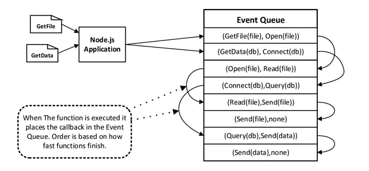

## 事件驱动


在我们使用Java，PHP等语言实现编程的时候，我们面向对象编程是完美的编程设计，这使得他们对其他编程方法不屑一顾。却不知大名鼎鼎Node使用的却是事件驱动编程的思想。那什么是事件驱动编程。
事件驱动编程，为需要处理的事件编写相应的事件处理程序。代码在事件发生时执行。 

```
         (事件对象)
事件源 ----------------> 事件处理程序（Listener）

```

事件驱动模型主要包含3个对象：事件源、事件和事件处理程序。

  事件源：产生事件的地方(如：html元素，某个定时任务，某次交易过程)

  事件：用户事件，即用户触发的事件，如：点击/鼠标操作/键盘操作等等，系统事件，系统运行过程中产生的事件，如：定时任务/告警/支付后积分变更事件等等

  事件对象：事件发生时，如果需要把事件传递给事件的关注者（listener），则会产生一个事件对象，封装事件的信息，如：发生时间，传递给谁，事件发生的上下文（一些交易数据，便于事件关注者作出处理）

  事件处理程序：也就是事件的监听者（Listener），响应事件的代码 

>事件驱动编程主要思想是通过事件或状态的变化来进行应用程序的流程控制，一般通过事件监听完成，一旦事件被检测到，则调用相应的回调函数。事件驱动主要执行过程是当进来的一个新的请求的时候，请求将会被压入队列中，然后通过一个循环来检测队列中的事件状态变化，如果检测到有状态变化的事件，那么就执行该事件对应的处理代码，一般都是回调函数。
线程驱动是当收到一个请求的时候，将会为该请求开一个新的线程来处理请求。而线程主要是由线程池来管理的。当线程池中有空闲的线程，会从线程池中拿取线程来处理，如果线程池中没有空闲的线程，新来的请求将会进入队列排队，直到线程池中空闲线程
原文链接：https://blog.csdn.net/charlene0824/article/details/51711154

-----




Node通过事件驱动的方式处理请求时无需为每一个请求创建额外的线程。在事件驱动的模型当中，每一个IO工作被添加到事件队列中，线程循环地处理队列上的工作任务，当执行过程中遇到堵塞任务时(如：读取文件、查询数据库、调用REST API接口)，线程不会停下来等待结果，而是留下一个处理结果的回调函数，转而继续执行队列中的下一个任务。这个传递到队列中的回调函数在堵塞任务运行结束后才被线程调用。


这一套实现开始于Node开始启动的进程，在这个进程中Node会创建一个循环，每次循环运行就是一个Tick周期，每个Tick周期中会从事件队列查看是否有事件需要处理，如果有就取出事件并执行相关的回调函数。事件队列事件全部执行完毕，node应用就会终止。Node对于堵塞IO的处理在幕后使用线程池来确保工作的执行。Node从池中取得一个线程来执行复杂任务，而不占用主循环线程。这样就防止堵塞IO占用空闲资源。当堵塞任务执行完毕通过添加到事件队列中的回调函数来处理接下来的工作。


事件驱动编程，为需要处理的事件编写相应的事件处理程序。代码在事件发生时执行。 
为需要处理的事件编写相应的事件处理程序。要理解事件驱动和程序，就需要与非事件驱动的程序进行比较。实际上，现代的程序大多是事件驱动的，比如多线程的程序，肯定是事件驱动的。早期则存在许多非事件驱动的程序，这样的程序，在需要等待某个条件触发时，会不断地检查这个条件，直到条件满足，这是很浪费cpu时间的。而事件驱动的程序，则有机会释放cpu从而进入睡眠态（注意是有机会，当然程序也可自行决定不释放cpu），当事件触发时被操作系统唤醒，这样就能【更加有效地使用cpu】。


## 非阻塞IO


- Node是一个单线程的语言，采用事件驱动和异步回调的机制。在执行代码的时候，主线程从上往下依次执行，遇到有需要回调的地方，就将此处加入到事件队列中，然后主线程继续往下走，直到运行结束以后，才去执行事件队列中的回调
- node去执行事件队列中的事件时，如果遇到回调，依然是按照顺序添加进入事件队列，主线程一次往下执行，遇到回调就添加，直至执行完毕。
- node是一个单线程多进程的。node进程创建一个循环，每个循环就是一个周期，在循环中会从事件队列里查看是否有事件需要处理，如果有就去除事件并执行相关的函数。对于阻塞事件的处理在幕后使用线程池来确保工作的运行，而不占用主循环流程。

作者：majunchang
链接：https://www.jianshu.com/p/f891839b27a3
来源：简书

