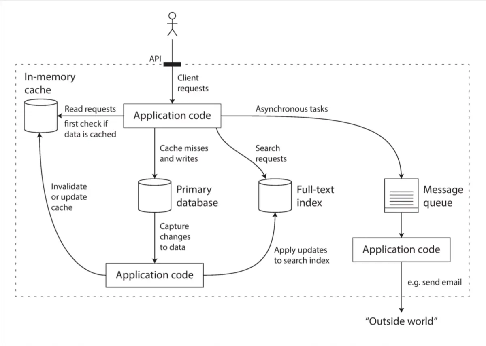

一个应用被称为数据密集型的(Data-Intensive applications),如果数据是其主要挑战（数据量，数据复杂度，数据变化速度），与之相对的是计算密集型，即处理器速度是其瓶颈。现今很多数据都是数据密集型的，而非计算密集型，CPU很少成为瓶颈。这是我们讨论这个问题的价值。

举例，什么算数据密集型应用？
- 场景1：微博，一条微博产生后，围绕这条数据展开的存储、搜索、转发、刷新
- 场景2：热搜，某条新闻成为热搜，会被大量浏览，评论，转发

以数据密集型的应用系统常规架构

数据密集型应用的特征：
1. 数据量
2. 数据复杂
3. 数据易变
4. I/O是速度瓶颈
5. 数据有传递需求
6. 对数据的获取方式： 拉、推
7. 对数据应用的三个关注点
    - 可靠性
    - 可扩展性
    - 可维护性

从0开始的大型架构基本是失败的，架构都是演进的。
数据密集型架构设计时避免引入“额外复杂度”

