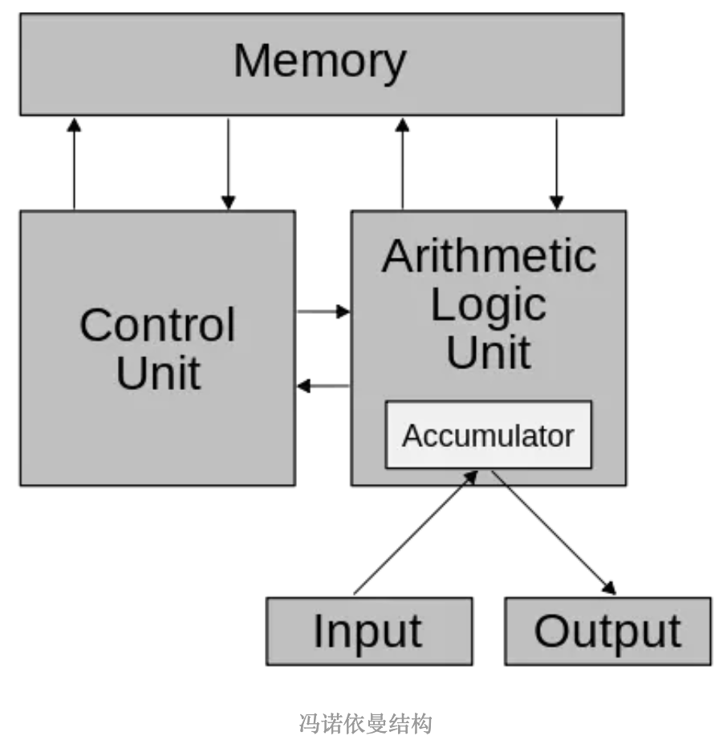
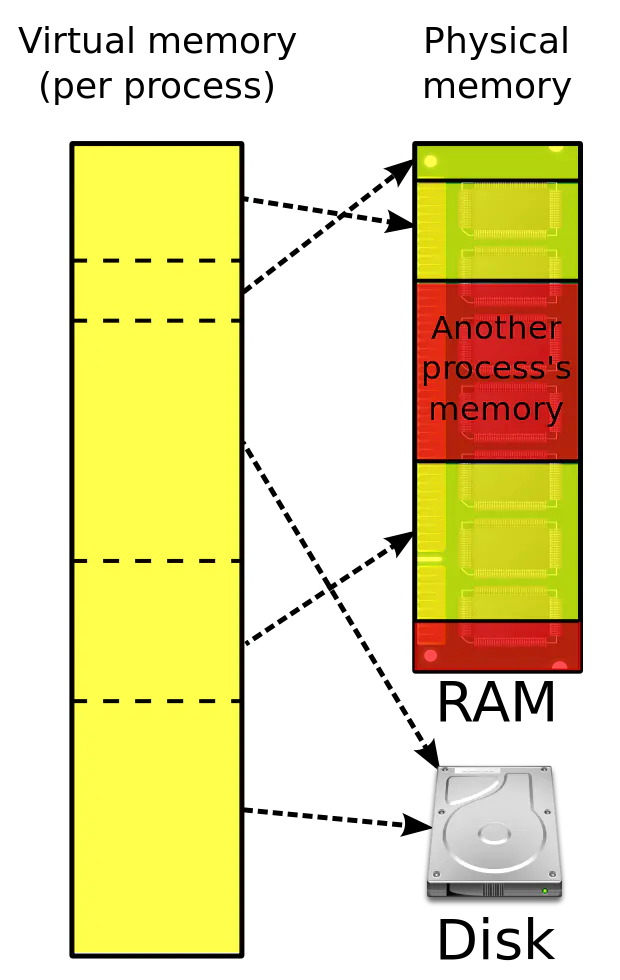
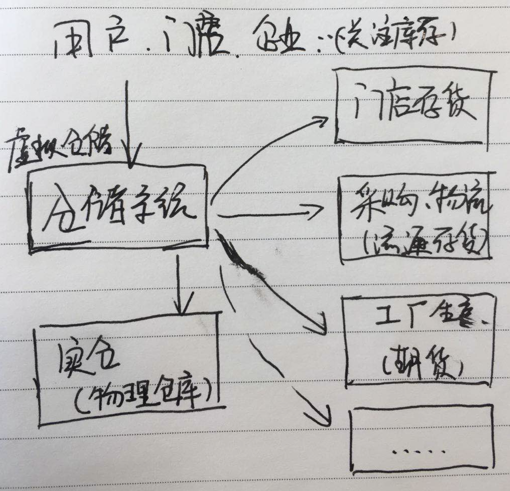
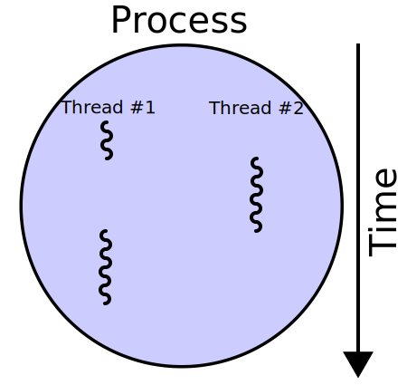

在[探索计算机的结构与核心概念](https://www.jianshu.com/p/f9d5b85afe6f)一文中从计算机的冯诺伊曼结构开始，简述了如下概念知识：
- 冯诺伊曼计算机结构
- 现代计算机结构
- 总线
- I/O设备
- 内存
- CPU
- 寄存器
- 程序计数器
- 高速缓冲
- DMA：DMA全称为Direct Memory Access直接内存访问,它允许其他硬件可以直接访问内存中的数据,而无需让CPU介入处理.一般会使用到DMA的硬件有显卡、网卡、声卡等.
- 流水线
- 超线程
- 多核
- 操作系统：操作系统是用于管理计算机硬件与软件的程序,可以把操作系统看成是应用程序与硬件之间插入的一层软件,所有应用程序对硬件的操作尝试都必须通过操作系统.操作系统需要负责管理与配置内存、调度系统资源的优先次序、管理进程与线程、控制I/O设备、操作网络与管理文件系统等事务.可以说操作系统是整个计算机系统中的灵魂所在.
- 虚拟内存
- 进程与线程
- 文件
- 网络
- OSI模型：OSI模型全称为开放式系统互联通信参考模型(Open System Interconnection Reference Model),是由国际标准化组织提出的一个试图使各种计算机在世界范围内进行互联通信的标准框架.
- TCP/IP
    - 三次握手
    - 四次握手
- 分组交换
- 数据展示：计算机编程语言拥有多种数据类型, 例如int、char、double等.但不管是什么类型的数据,在计算机中其实都只是一个字节序列(以8位二进制为一个字节).每个机器中对字节序列的排序不大相同,有一些机器按照从最高有效字节到最低有效字节的顺序存储,这种规则被称为大端法;还有一些机器将最低有效字节排在最前面,这种规则被称为小端法.
- 浮点数
- 函数调用： 当调用一个函数时,系统会在栈上分配一个空间,存放了函数中的局部变量、函数参数、返回地址等,这样的一个结构被称为栈帧.函数中的数据的存活状态是后进先出的,而栈正好是满足这一特性的数据结构,这也是为什么计算机使用栈来当作函数调用的存储结构.
- 计算机编程语言

如下是一时的思考记录：

# ‘设计’就是是对‘现实问题’的合理抽象

看看冯诺伊曼对计算机的抽象：

启发：
- 王东岳的哲学启蒙，此刻看冯诺伊曼的计算机结构原理， 有这么一想：哲学是对人的一个最顶层抽象，抽象结果为： 生，死；哪些追问都围绕着这个结果。
- 冯诺伊曼对计算机的抽象结果是：输入输出，控制器，运算器，存储器。
- 而计算机是一种承载人类智力和思考运算的设备，那么这个人类智力的抽象结果是：输入，运算（计算，控制/指令，缓存/存储），输出。
- 通过阅读，倾听，动手。。。促进抽象能力，提高思考能力。

# 虚拟内存

虚拟内存是计算机系统内存管理的一种技术,它为每个进程提供了一个假象,即每个进程都在独占地使用内存(一个连续的地址空间),而实际上,它通常被分割为多个物理内存碎片,还有部分暂时存储在磁盘存储器上,在需要时进行数据交换.使用虚拟内存会使程序的编写更加容易,对真实的物理内存的使用也会更加有效率.

启发：
- 虚拟仓储 —— 应用系统层面每个门店都有一个库存数据，实际上真实的货品、数量、进出都在某个实际的仓库中；
- 虚拟仓储技术可用作数字化仓储的应用建设中；

# 进程和线程

### 进程

进程是操作系统对一个正在运行的程序的一种抽象,它是程序的执行实体,是操作系统对资源进行调度的一个基本单位,同时也是线程的容器.

进程跟虚拟内存一样,也是操作系统提供的一种假象,它让每个程序看上去都是在独占地使用CPU、内存和I/O设备.但其实同一时间只有一个进程在运行,而我们能够边听歌边上网边码代码的原因其实是操作系统在对进程进行切换,一个进程和另一个进程其实是交错执行的,只不过计算机的速度极快,我们无法感受到而已.

操作系统会保持跟踪进程运行所需的所有状态信息,这种状态,被称为上下文(Context),它包含了许多重要的信息,例如程序计数器和寄存器的当前值等.当操作系统需要对当前进程进行切换时(转移到另一个进程),会保存当前进程的上下文,然后恢复新进程的上下文,这时控制权会移交到新进程,新进程会从它上次停下来的地方开始执行,这个过程叫做上下文切换.

操作系统的进程空间可以分为用户空间与内核空间,也就是用户态与内核态.它们的执行权限不同,一般的应用程序是在用户态中运行的,而当应用程序执行系统调用时就需要切换到内核态,由内核执行.

### 线程

线程是操作系统所能调度的最小单位,它被包含在进程之中,且一个进程中的所有线程共享进程的资源,一个线程一般被指为进程中的一条单一顺序的控制流.

线程都运行在进程的上下文中,虽然线程共享了进程的资源,但每条线程都拥有自己的独立空间,例如函数调用栈、寄存器、线程本地存储.

线程的实现主要有以下三种方式:

使用内核线程实现: 内核线程就是由操作系统内核直接支持的线程,这种线程由内核来完成线程切换调度,内核通过调度器对线程进行调度,并将线程的任务映射到各个处理器上.应用程序一般不会直接使用内核线程,而是使用内核线程的一个接口: 轻量级进程,每个轻量级进程都由一个内核线程支持,所以它们的关系是1:1的.这种线程的实现方式的缺点也很明显,应用程序想要进行任何线程操作都需要进行系统调用,应用程序会在用户态和内核态之间来回切换,消耗的性能资源较多.

使用用户线程实现: 这种方式将线程完全实现在用户空间中,相关的线程操作都在用户态中完成,这样可以避免切换到内核态,提高了性能.但正因为没有借助系统调用,操作系统只负责对进程分配资源,这些复杂的线程操作与线程调度都需要由用户线程自己处理实现,提高了程序的复杂性.这种实现方式下,一个进程对应多个用户线程,它们是1:N的关系.

混合实现: 这是一种将内核线程与用户线程一起使用的实现方式.在这种实现下,即存在用户线程,也存在轻量级进程.用户线程依旧是在用户空间中建立的(相关的线程操作也都是在用户空间中),但使用了轻量级进程来当作用户线程与内核线程之间的桥梁,让内核线程提供线程调度和对处理器的映射.这种实现方式下,用户线程与轻量级进程的数量比例是不定的,它们是N:M的关系.

