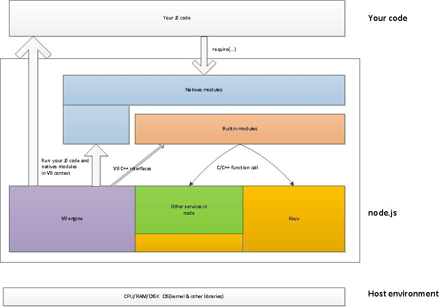

- your code 为编辑代码，node.js 核心，Host environment 为宿主环境（提供各种服务，如文件管理，多线程，多进程，IO etc）
这里重点介绍，nodejs组成部分：v8 engine, libuv, builtin modules, native modules以及其他辅助服务。

- 当我们执行node xxx.js的时候，node会先做一些v8初试化，libuv启动的工作，然后交由v8来执行native modules以及我们的js代码。

v8 engine：主要有两个作用 1.虚拟机的功能，执行js代码（自己的代码，第三方的代码和native modules的代码）。

　　　　　　　　　　　　   2.提供C++函数接口，为nodejs提供v8初始化，创建context，scope等。

libuv：它是基于事件驱动的异步IO模型库，我们的js代码发出请求，最终由libuv完成，而我们所设置的回调函数则是在libuv触发。

builtin modules：它是由C++代码写成各类模块，包含了crypto，zlib, file stream etc 基础功能。（v8提供了函数接口，libuv提供异步IO模型库，以及一些nodejs函数，为builtin modules提供服务）。

native modules：它是由js写成，提供我们应用程序调用的库，同时这些模块又依赖builtin modules来获取相应的服务支持

简单总结一下：如果把nodejs看做一个黑匣子，起暴露给开发者的接口则是native modules，当我们发起请求时，请求自上而下，穿越native modules，通过builtin modules将请求传送至v8，libuv和其他辅助服务，请求结束，则从下回溯至上，最终调用我们的回调函数。

这里我们以建立http server为例

如上图所示：v8执行js代码 server.listen()时，会通过一些基础服务到TCPWrap::listen(),TCPWrap是nodejs的內建模块，其通过libuv的api uv_listen()的方式，由libuv来完成异步调用。

图中1,2,3,4,5步骤标明了调用和返回的路径，这几步很快结束，留下callback TCPWrap::OnConnection()等着所需要的数据准备好后被调用。

libuv在得到所需要的请求后，会调用callback TCPWrap::OnConnection()，在该函数最后通过 tcp_wrap->MakeCallback(env->onconnection_string(), ARRAY_SIZE(argv), argv) 调用V8 engine中的JavaScript callback。

Node.js内建模块http其实是建立在模块net之上的。如果看net.js代码会发现，其通过 new TCP() 返回的类对象完成后续的TCP connect, bind, open等socket动作。

可以看到Node.js做的工作像是一座桥。左手V8，右手libuv，将2者有机连接在一起。例如HandleWrap::HandleWrap()中记录了V8 instance中的JavaScript对象以及TCPWrap对象。这样在TCPWrap::OnConnection()中可以拿到这两个对象，执行后续的callback调用。

来自： https://www.cnblogs.com/peiyu1988/p/8192066.html
