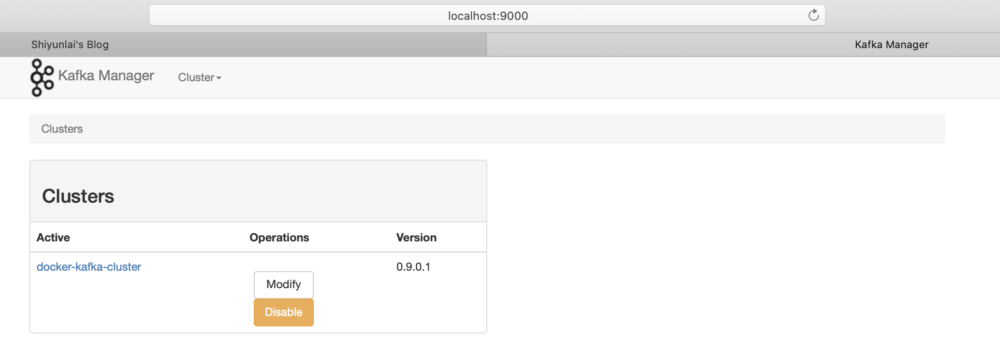
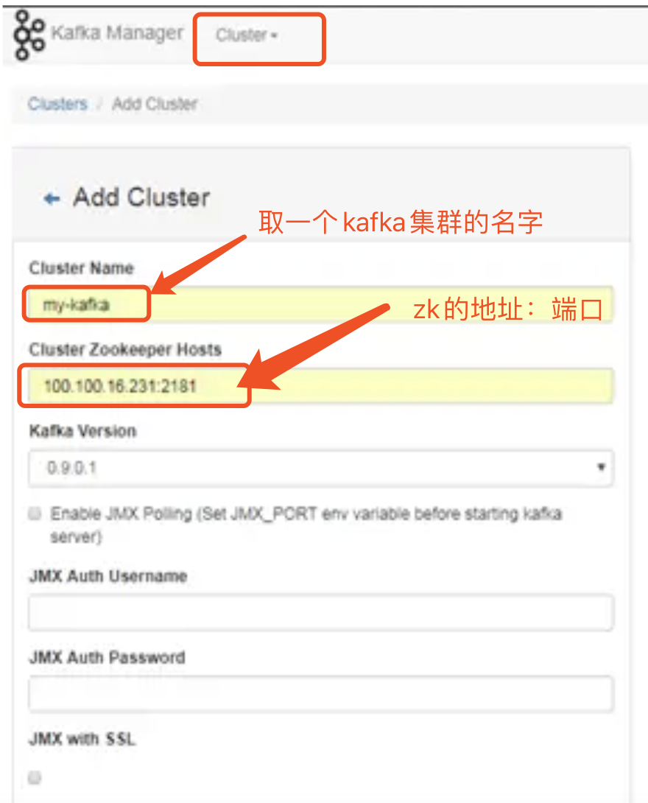
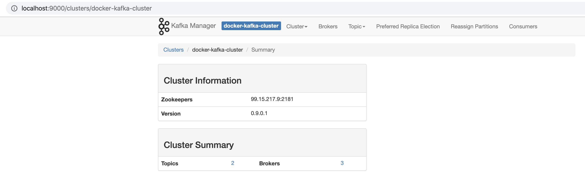
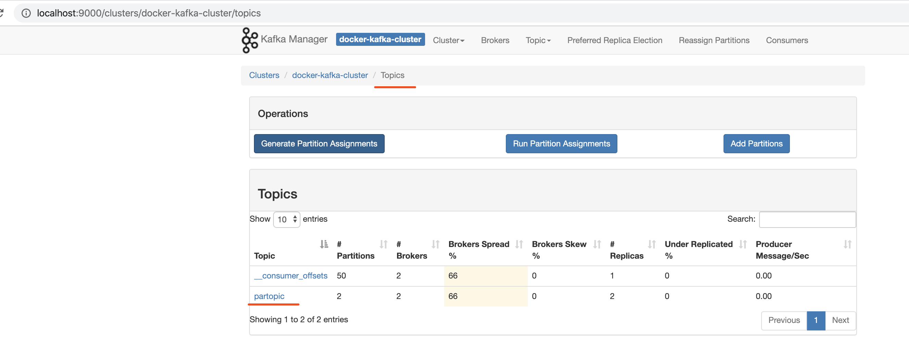
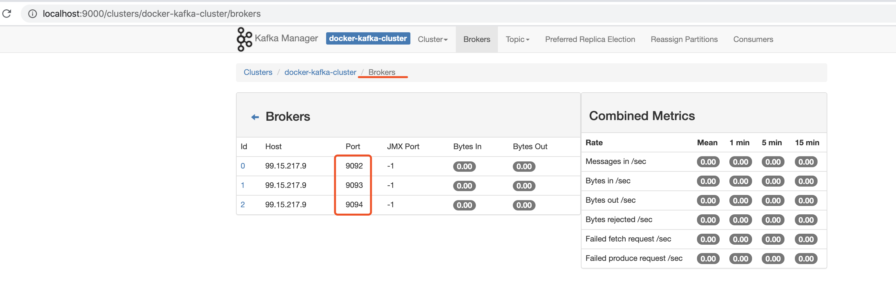
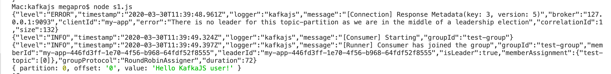

ITP平台中准备使用kafka作为队列，重构升级指令供，于是本地弄一套Kafka方便测试Node.js相关的代码。

以下环境搭建前提：
1. Mac
1. Docker 19.03.8


# 搭建步骤

## 查看本机ip

```shell
$ ifconfig en0
```
输出
```
en0: flags=8863<UP,BROADCAST,SMART,RUNNING,SIMPLEX,MULTICAST> mtu 1500
	options=400<CHANNEL_IO>
	ether f8:ff:c2:44:c0:12 
	inet6 fe80::1804:f18d:fb:655c%en0 prefixlen 64 secured scopeid 0x6 
	inet 99.15.217.9 netmask 0xffffff00 broadcast 99.15.217.255
	nd6 options=201<PERFORMNUD,DAD>
	media: autoselect
	status: active
```

其中99.15.217.9 这个IP在下面的命令行中要用


## 下载zookeeper镜像

$ docker pull wurstmeister/zookeeper

## 下载kafka镜像

$ docker pull wurstmeister/kafka

## 下载图形化kafka管理镜像

$ docker pull sheepkiller/kafka-manager

## 下载一个图形化zookeeper工具（可执行jar包，这个不是镜像）
[zookeeper-dev-ZooInspector.zip](https://www.jianshu.com/go-wild?ac=2&url=https%3A%2F%2Fissues.apache.org%2Fjira%2Fsecure%2Fattachment%2F12436620%2FZooInspector.zip)

解压启动

```shell
java -jar build/zookeeper-dev-ZooInspector.jar
```

## 启动zookeeper
docker run -d --name zookeeper -p 2181:2181 -t wurstmeister/zookeeper

## 启动kafka（集群方式）

- kafka节点 1

```shell
$ docker run -d --name kafka -p 9092:9092 -e KAFKA_BROKER_ID=0 -e KAFKA_ZOOKEEPER_CONNECT=99.15.217.9:2181 -e KAFKA_ADVERTISED_LISTENERS=PLAINTEXT://99.15.217.9:9092 -e KAFKA_LISTENERS=PLAINTEXT://0.0.0.0:9092 -t wurstmeister/kafka
```

- kafka节点 2

```shell
$ docker run -d --name kafka1 -p 9093:9093 -e KAFKA_BROKER_ID=1 -e KAFKA_ZOOKEEPER_CONNECT=99.15.217.9:2181 -e KAFKA_ADVERTISED_LISTENERS=PLAINTEXT://99.15.217.9:9093 -e KAFKA_LISTENERS=PLAINTEXT://0.0.0.0:9093 -t wurstmeister/kafka
```

- kafka节点3

```shell
$ docker run -d --name kafka2 -p 9094:9094 -e KAFKA_BROKER_ID=2 -e KAFKA_ZOOKEEPER_CONNECT=99.15.217.9:2181 -e KAFKA_ADVERTISED_LISTENERS=PLAINTEXT://99.15.217.9:9094 -e KAFKA_LISTENERS=PLAINTEXT://0.0.0.0:9094 -t wurstmeister/kafka
```

> - --name kafka 指定不同的docker容器名称，不要重复
> - -e KAFKA_BROKER_ID 指定kafka的Broker序号，不要重复
> - -e KAFKA_ZOOKEEPER_CONNECT 指定所用zookeeper的地址端口
> - -e KAFKA_ADVERTISED_LISTENERS 指定Kafka的监听端口
> - -e KAFKA_LISTENERS 指定Kafka的监听端口
> - -t wurstmeister/kafka 所使用的Docker镜像

## 检测一下启动情况，主要看看端口

```shell
netstat -an | grep 2181
netstat -an | grep 9092
netstat -an | grep 9093
netstat -an | grep 9094
```

再看一看Docker容器情况
```shell
$ docker ps -a 
```
如果Docker容器启动出现错误，可查看容器运行日志，如，查看id为dc9208a3303fee的容器运行日志的最后1000行

```shell
$ docker logs dc9208a3303fee --tail 1000
```

## 查看docker容器，并启动

如果正常执行过以上步骤，之后可直接启动docker容器，如下：

查看容器
```shell
$ docker ps
Mac:gitee megapro$ docker ps -a
CONTAINER ID        IMAGE                       COMMAND                  CREATED             STATUS                            PORTS               NAMES
d281bab38702        wurstmeister/kafka          "start-kafka.sh"         7 days ago          Exited (137) 4 minutes ago                            kafka2
b2ae4f0b7c09        sheepkiller/kafka-manager   "./start-kafka-manag…"   7 days ago          Exited (143) 4 minutes ago                            kafka-manager
119a70531dbc        wurstmeister/kafka          "start-kafka.sh"         7 days ago          Exited (137) 3 minutes ago                            kafka1
e1d2bcb81ff2        wurstmeister/kafka          "start-kafka.sh"         7 days ago          Exited (137) 3 days ago                               kafka
156a5c4c0e41        wurstmeister/zookeeper      "/bin/sh -c '/usr/sb…"   7 days ago          Exited (137) About a minute ago                       zookeeper
```

启动zookeeper+kafka
```shell
$ docker start 156a5c4c0e41
$ docker start e1d2bcb81ff2
$ docker start 119a70531dbc
$ docker start d281bab38702
$ docker start b2ae4f0b7c09

```


## 做个测试

场景：登录kafka主机，创建一个topic，向topic发送消息，使用consumer接收消息

进入kafka容器的命令行
```shell
$ docker exec -ti kafka /bin/bash
```
进入kafka所在目录
```shell
$ cd opt/kafka_2.12-1.1.0/bin
```
创建Replication为2，Partition为2的topic = partopic:
```shell
$ ./kafka-topics.sh --create --zookeeper 99.15.217.9:2181 --replication-factor 2 --partitions 2 --topic partopic
```

查看topic状态
```shell
$ ./kafka-topics.sh --describe --zookeeper 99.15.217.9:2181 --topic partopic
```

作为Producer生产消息
```shell
$ ./kafka-console-producer.sh --broker-list 99.15.217.9:9092 --topic partopic
```

新开一个终端，作为Consumer接收消息

```shell
$ docker exec -it kafka /bin/bash
$ cd opt/kafka_2.12-1.1.0/bin
```

接收消息
```shell
$ ./kafka-console-consumer.sh --bootstrap-server 99.15.217.9:9092 --topic partopic --from-beginning
···

至此验证成功！


## 启动kafka管理界面服务kafka-manager

```shell
$ docker run -itd --restart=always --name=kafka-manager -p 9000:9000 -e ZK_HOSTS=99.15.217.9:2181  sheepkiller/kafka-manager
```

访问: http://localhost:9000



添加一个cluster



确定，然后就能查看kafak的集群信息



查看topic信息



查看Broker们的信息



环境好了，去写代码和kafka集成吧！

## 跑个Node.js代码试一下

[kafkajs Getting Started](https://www.npmjs.com/package/kafkajs)
```js 
const { Kafka } = require('kafkajs')

const kafka = new Kafka({
    clientId: 'my-app',
    brokers: ['127.0.0.1:9092', '127.0.0.1:9093']
})

const producer = kafka.producer()
const consumer = kafka.consumer({ groupId: 'test-group' })

const run = async () => {
    // Producing
    await producer.connect()
    await producer.send({
        topic: 'test-topic',
        messages: [
            { value: 'Hello KafkaJS user!' },
        ],
    })

    // Consuming
    await consumer.connect()
    await consumer.subscribe({ topic: 'test-topic', fromBeginning: true })

    await consumer.run({
        eachMessage: async ({ topic, partition, message }) => {
            console.log({
                partition,
                offset: message.offset,
                value: message.value.toString(),
            })
        },
    })
}

run().catch(console.error)
```

执行

```shell
$npm i kafkajs -S
$node s1.js
```

输出



## 主要参考资料
- [Mac 使用 docker 搭建 kafka 集群 + Zookeeper + kafka-manager](https://www.jianshu.com/p/fe73765ef74d)
- [docker 安装zookeeper+kafka单节点](https://www.jianshu.com/p/e642793cd5de)


