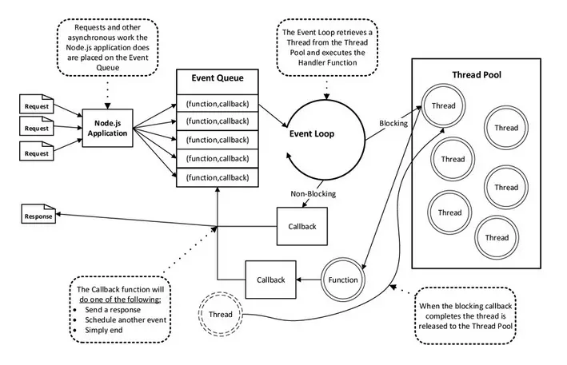
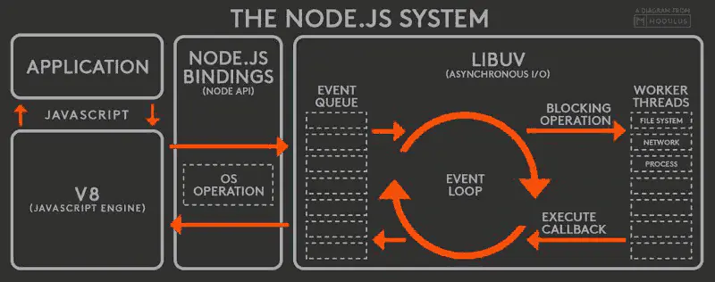

应用程序处理请求的过程中可以分为两个部分：CPU运算和I/O读写。通常CPU计算速度远高于I/O操作速度，这就导致CPU运算已经完成，但是不得不等待I/O任务完成之后再继续接下来处理。所以I/O会成为某些应用程序的瓶颈所在，假设在I/O密集型应用场景中，一次请求/响应的耗时为100ms，其中90ms花在I/O上。

  就以上场景，怎样才能让系统能同时处理更多的请求？

  一种方案是采用多线程，按照并发量开启同等数量的线程或建立可复用的线程池，来提升对请求吞吐量。但是，在大并发场景下，操作系统内核将消耗大量时间切换线程和线程上下文，多线程结构还是无法做到强大的伸缩性。

  看看Node.js的解决方案！

  Node采用了单线程的结构，避免了上下文切换了浪费！

  > “单线程的最大好处，是不用像多线程编程那样处处在意状态的同步问题，这里没有死锁的存在，也没有线程上下文切换所带来的性能上的开销” —— 《深入浅出Node》

  虽然一条线程没有了上下文切换的损耗，但是只用一条线程干活（表面上，实际情况后续分析），怎么能应付大并发量呢？！

来看网友对Node.js运行机制给出的一个比喻：

>...NodeJS在寒风中面对着10万并发大军，OK，没问题，上来敌人一个扔到城里，上来一个又扔到城里。城里全民皆兵，可以很好地消化这些敌人...
>- [Nodejs的运行原理-科普篇](https://www.cnblogs.com/peiyu1988/p/8032982.html)

下图诠释了如上Node.js机制原理

- 所有同步任务都在主线程上执行，形成一个执行栈
- 主线程发起异步请求,相应的工作线程就会去执行异步任务,
- 主线程可以继续执行后面的代码
- 主线程之外，还存在一个"任务队列"（task queue）。只要异步任务
- 有了运行结果，就在"任务队列"之中放置一个事件,也就是一个消息。
- 一旦"执行栈"中的所有同步任务执行完毕，系统就会读取"任务队列"，看看里面有哪些事件。那些对应的异步任务，于是结束等待状态，进入执行栈，开始执行。
- 主线程把当前的事件执行完成之后,再去读取任务队列,如此反复重复执行,这样就形成了事件循环（Event Loop）。
- 只要主线程空了，就会去读取"任务队列"，这就是JavaScript的运行机制。
- 这个过程会不断重复。

（重点）因此，Node.js的单线程并不是真正的单线程，只是开启了单个线程进行业务处理（cpu的运算），同时开启了其他线程专门处理I/O。当一个指令到达主线程，主线程发现有I/O之后，直接把这个事件传给I/O线程，不会等待I/O结束后，再去处理下面的业务，而是拿到一个状态后立即往下走，这就是“单线程”、“异步I/O”。

I/O处理完之后会有一个回调事件，这个事件会放在一个事件处理队列里头，在进程启动时node会创建一个类似于While(true)的循环，它的每一次轮询（tick）都会去查看是否有事件需要处理，是否有事件关联的回调函数需要处理，如果有就处理，然后加入下一个轮询，如果没有就退出进程，这就是所谓的“事件驱动”。这也从Node的角度解释了什么是”事件驱动”。

在node.js中，事件主要来源于网络请求，文件I/O等，根据事件的不同对观察者进行了分类，有文件I/O观察者，网络I/O观察者。事件驱动是一个典型的生产者/消费者模型，请求到达观察者那里，事件循环从观察者进行消费，主线程就可以马不停蹄的只关注业务不用再去进行I/O等待。

（1）V8 JavaScript引擎负责解析JavaScript脚本并执行代码。

（2）解析后的代码，调用Node API。

（3）libuv库负责NodeAPI的执行。它将不同的任务分配给不同的线程，形成一个Event Loop（事件循环），以异步的方式将任务的执行结果返回给V8引擎。

（4）V8引擎再将结果返回给用户。

看到没，NodeJS的工作原理其实就是事件循环。可以说每一条NodeJS的逻辑都是写在回调函数里面的，而回调函数都是有返回之后才异步执行的！
看到这里，你不禁会惊叹，NodeJS如果所有处理都异步，岂不是晓得飞了？错错错！当然不是，不要忘记，NodeJS实现这些的基础是单线程。没错，单线程！一条线程扛起所有操作！
你可以想象一下，NodeJS在寒风中面对着10万并发大军，OK，没问题，上来敌人一个扔到城里，上来一个又扔到城里。城里全民皆兵，可以很好地消化这些敌人。但如果上来一个类似于张飞赵云这样的人物，老Node心里一惨，和张飞大战300回合，把他打残了，再扔到城里。那后面的10万大军就得等这300回合。。。
所以这说明什么？说明NodeJS不是没有阻塞，而是阻塞不发生在后续回调的流程，而会发生在NodeJS本身对逻辑的计算和处理。我们已经知道，NodeJS的分发能力无比强大，可以循环事件进行异步回调。但如果在循环事件时遇到复杂的逻辑运算，那么单薄的单线程怎么支撑得起上百万的逻辑+并发呢？NodeJS它的所有I/O、网络通信等比较耗时的操作，都可以交给worker threads执行再回调，所以很快。但CPU的正常操作，它就只能自己抗了。 
说到这里，各位对NodeJS的特性估计也大概有个谱了。所以说适用的场景基本是呼之欲出了~！
